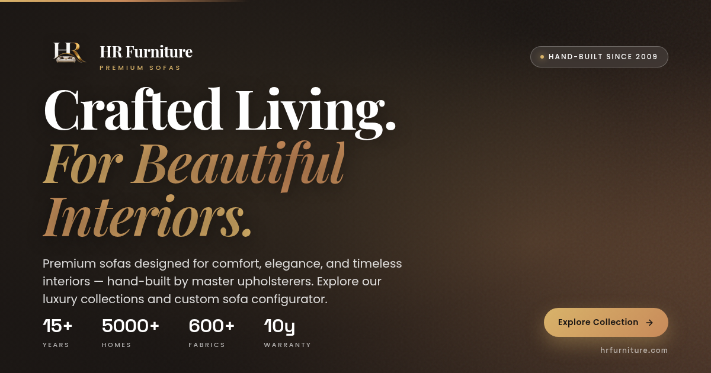

# HR Furniture — Premium Sofas & Living Furniture

A modern, premium, highly animated furniture website built with Next.js 16, React 19, Three.js, Framer Motion, GSAP, and Lenis smooth scroll. Designed to feel like a luxury digital showroom.



## ✨ Features

- **Immersive Hero** — Professional luxury living room background with split-letter text reveal, parallax scroll, and dual gradient overlays for text readability.
- **Featured Categories** — 7 furniture categories with real interior photography, hover lift, animated borders, and a "Browse All" CTA card.
- **Why HR Furniture** — 6 animated feature cards (Premium Materials, Expert Craftsmanship, Custom Designs, Affordable Luxury, Fast Delivery, Long-lasting Quality) plus an "As Featured In" trust strip.
- **Featured Collection** — 6 signature sofas with professional product photography, hover Quick View/Inquire actions, save/like buttons, and pricing.
- **Interactive 3D Showcase** — React Three Fiber scene with OrbitControls (rotate, zoom), live fabric and wood finish swatches, dimension readouts.
- **Before & After Interior** — Drag-to-compare split slider with real before/after room photography.
- **Materials Section** — 8 interactive fabric, leather, and wood swatches with type-based texture overlays and a light sweep animation.
- **Custom Sofa Builder** — 5-step configurator (Shape → Fabric → Wood → Leg → Size) with live SVG preview and dynamic pricing.
- **Statistics** — Counter animations on scroll with gradient gold numbers.
- **Testimonials** — Dual marquee rows scrolling in opposite directions with glassmorphic cards.
- **Gallery** — Masonry grid with 4 size variations (big/tall/wide/square), hover overlays, location/collection info.
- **Process Timeline** — 5-step horizontal (desktop) / vertical (mobile) timeline with scroll-triggered animated connecting line.
- **FAQ** — Accordion with smooth height transitions and rotating +/- icons.
- **CTA + Contact** — Dark premium banner with quick inquiry form, contact details strip, and a synthesized Google Map with pulsing pin.
- **Footer** — Newsletter signup, brand info, social icons, 4-column links, back-to-top.
- **WhatsApp floating button** for instant inquiries.

## 🎨 Design System

| Token | Color |
|-------|-------|
| Background | `#FFFFFF` |
| Warm White | `#FAFAF8` |
| Walnut Brown | `#7A5230` |
| Terracotta | `#C88A5A` |
| Champagne Gold | `#D8B36A` |
| Dark Walnut | `#3E2A20` |
| Text Primary | `#1D1D1D` |
| Text Secondary | `#5E5E5E` |

**Typography**: Playfair Display (headings), Inter (body), Poppins (buttons), Space Grotesk (numbers).

## 🛠 Tech Stack

- **Framework**: Next.js 16 (App Router) + React 19 + TypeScript 5
- **Styling**: Tailwind CSS 4 + shadcn/ui (New York)
- **Animation**: Framer Motion + GSAP + Lenis smooth scroll
- **3D**: Three.js + React Three Fiber + @react-three/drei
- **Icons**: Lucide React
- **Fonts**: next/font (Playfair Display, Inter, Poppins, Space Grotesk)
- **Images**: Next.js Image component with optimization

## 🚀 Getting Started

```bash
# Install dependencies
bun install

# Run development server
bun run dev

# Open http://localhost:3000
```

## 📦 Deployment (Vercel)

1. Push this repo to GitHub.
2. Import the project at [vercel.com/new](https://vercel.com/new).
3. Add the environment variable:
   - `NEXT_PUBLIC_SITE_URL` = `https://your-domain.com` (used by `metadataBase` for OG/Twitter URLs)
4. Deploy. The OG image will work on WhatsApp, Facebook, Twitter, LinkedIn, etc.

## 🎯 Brand Assets

- **Logo**: `/public/brand/logo-transparent.png` (master, 500×500 RGBA with transparent background)
- **Favicons**: 11 PNG sizes (16–1024px) + ICO + Apple touch icon in `/public/brand/`
- **OG image**: `/public/og-image.png` (1200×630)
- **Web manifest**: `/public/site.webmanifest`

To regenerate favicons from a new logo:
```bash
python3 scripts/remove-bg.py    # Remove background from logo-original.jpg
node scripts/gen-favicons.js    # Regenerate all favicon sizes
```

## 📁 Project Structure

```
src/
├── app/
│   ├── layout.tsx              # Root layout, fonts, OG metadata, favicons
│   ├── page.tsx                # Main page composition
│   └── globals.css             # Design system + utilities
├── components/
│   ├── providers/              # SmoothScrollProvider (Lenis)
│   ├── site/                   # Navbar, Footer, CursorGlow
│   ├── three/                  # HeroScene (React Three Fiber)
│   └── sections/               # 15 homepage sections
└── lib/
    ├── site-data.ts            # All content (categories, products, testimonials, etc.)
    ├── anim.ts                 # Reveal/counter hooks
    └── utils.ts                # cn() helper

public/
├── brand/                      # Logo + favicons
├── hero/                       # Hero background image
├── products/                   # 6 product photos
├── scenes/                     # 15 interior scene photos
├── og-image.png                # 1200x630 social sharing image
├── site.webmanifest            # PWA manifest
└── browserconfig.xml           # MS tile config
```

## 📄 License

© HR Furniture. All rights reserved.
